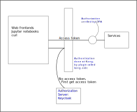

# Proposal

+ To use OAuth for authorization, and OpenID Connect for authentication

> (TLDR: Token-based authorization)

---

### Why OAuth over CAS?

+ OAuth is a highly popular authorization framework, which gives us
  + Good library support in many languages
  + More resources online if we need development assistance
+ OAuth is stable, yet still under heavy development - protocols continue to be built on top of OAuth
  + OpenID Connect, which is itself already very stable
  + Token Exchange - an example of how people found unsupported use cases, and extended the framework to support more cases
  + User Managed Access, which we might need in the future
+ OAuth has a well-defined specification, and this specification has been publicly reviewed
  + Takes the form of RFCs
  + There are even reviews of the threat model and documented security consideration (RFC 6819)

???

+ Shows the attention people have given to security in this framework

---

### The key shift

???
+ The use of tokens for authorization purposes
+ If no token is presented, callers first get a token, and then all
  authorization is done based on tokens
+ App developers supported with authentication and authorization services
+ Want to try and minimize the use of all-powerful API keys to communicate between services
+ Inter-service calls should instead pass the user's token to other services it is calling
  + Through Kong once again

---

### Rationale behind technology choices

+ Extensibility and developer-friendliness as a primary consideration
  + Given our security requirements, this is going to be a core infrastructural component
  + Will be seeking resourcing for adequate development and engineering ops in this area
+ Build the integration layer between technology ourselves
  + Long term adaptability to our varied requirements
  + Avoid vendor lock-in

---

### Technology choices

---

### Component: Keycloak

+ Acts as the OAuth authorization server and OpenID Provider
+ Key role in the entire setup is that it is where all the tokens are minted
  + All other services have to trust tokens minted by keycloak (e.g. via
    certificates)
+ It is also where authentication happens
  + Nobody should be running their own authentication after this
  + Use of API keys between services for authentication and authorization
    should be minimized
+ Made my own comparison against CAS, documented everything on GitHub
+ I'm not the only one who thinks CAS is hard to set up
  + https://gist.github.com/bmaupin/6878fae9abcb63ef43f8ac9b9de8fadf

---

### Component: Kong

+ Kong's role is to handle authentication
  + "If you don't have an access token, go get one from Keycloak first"
+ We use the kong-oidc plugin to handle OAuth's auth code flow

---

### Component: OPA

+ Acts as the policy enforcer
  + App developer packages information, including access token and other app
    level information
  + OPA decides yes/no based on that information, on a familiar http interface
  + (validates the access token)
+ OPA is a single binary, can support both physical machines/VMs and definitely
  as a sidecar in k8s deployments
+ OPA has endpoints for dynamic reading/writing of policy rules
  + Is a key part of policy centralization in OPA

???

+ Validating the access token is a key part of this architecture because we
  need to be sure that Keycloak indeed minted the token
+ It is true that exposing policy is not the same as centralization but it is a
  very good starting point
  + Given our very varied authorization requirements, apps are likely to have
    to have custom policies
  + With complex policies, OPA serves us well because there is room for
    programmatic manipulation of policies

---

### OPA: Usage patterns

Apps should try and use this pattern unless their authorization needs require
stronger coupling.

???

These patterns are not unique to container deployments. Think of the shapes as
different services running on a VM.

This is the usage pattern we prefer
+ It decouples authorization from the main application almost completely
+ Encourages good API design in the organization of resources and using HTTP
  methods suitably
+ Easy testing, because app devs can test assuming that any traffic even
  reaching the app is already authorized

> Thanks Shawn for this question!

Why is OPA on the app side, why not get Kong to ask OPA for auth information
and skip having another proxy?

We might want to explore that in future.

In the near term, OPA needs to validate the token to prevent spoofing of roles
in a spoofed jwt after bypassing kong.

A valid token is how we establish trust between Kong and the app now. If we use
other ways of establishing trust, such as mTLS or point to point firewall
rules, then we might want to shift the authorization done by OPA over to Kong.

---

### OPA: More complex authorization

Apps can use this if the app maintains data that contributes to OPA's decision.

???

We want to make sure that close to all authorization decisions are made by OPA,
for centralization and audit purposes.

Even whitelisted paths should first go to OPA for a decision to be made.

---

### Also considered using Keycloak auth services for authorization

+ Keycloak auth services is a Keycloak-provided service
+ Libraries/adapters are provided for apps to connect to keycloak to ask yes/no
  + 1st-party Java adapter support, 3rd party
  + Every call to the app requires an external call to Keycloak, barring caching
+ Pros: UI and API for managing the auth policies at keycloak
+ Cons
  + In actual implementation, there are inconsistencies in policy enforcement
  + Auth svcs not as flexible in terms of policies, and custom policies require
    uploading of jars to Keycloak

---

### Extensibility considerations: API Gateway Architecture

+ API gateway architecture for the immediate future
+ May want to move to other archtectures to leverage mesh offerings in future
  + For now we have to take into account non-k8s services
  + Gateways are more well understood still
+ On a conceptual level nothing should change
  + Provide authentication and authorization as services - both should stay
    outside the application as much as possible

???

Even if we move to Istio for example, we will just perhaps issue sidecars to
replace the gateway

---

### Extensibility considerations: Automated sign on based on OS creds

+ Automated sign on is a layer on top of this
+ Enable a flag in Chrome to allow Chrome to pass creds over SPNEGO to KC for authentication
+ Everything else remains the same because applications continue to rely on access tokens

---

### Extensibility considerations: Zero Trust

+ Multi-factor authentication
  + Keycloak supports OTP already
  + RedHat is backing Keycloak and is likely to provide authentication as the
    industry thinks is valuable
  + Provides Authentication SPI (Service Provider Interface) for any future
    custom authentication that we might dream of
+ Device authentication is one part of Zero Trust that we don't have
  + It can be implemented with a client side component adding information about
    the device for the authorization server to verify
  + Keycloak is definitely extensible to support additional verification

---

### Implementation phases

1. Roll out Keycloak and Kong
2. Help app to onboard
3. Migrate users and verify in production
4. Run app to understand engineering ops challenges
5. Focus on making TLS available for developers to secure traffic all the way
6. ... layer on extensions later ...
